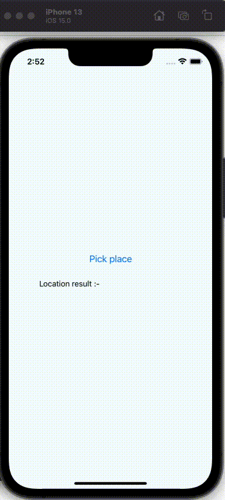
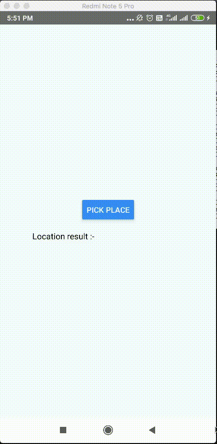

# react-native-google-auto-complete-place-picker [](https://badge.fury.io/js/react-native-google-auto-complete-place-picker)

Native iOS & Android google place autocomplete picker wrapped into React Native App.

iOS | Android
------- | ----
 | 

## Table of contents
- [Install](#install)
  - [iOS](#ios)
  - [Android](#android)
- [Usage](#usage)
  - [Example](#example)
- [Response object](#the-response-object)

## Installation

Add the npm package:


```js
npm i react-native-google-auto-complete-place-picker --save
```
#### iOS
Installation on iOS should be completely handled with auto-linking, if you have ensured pods are installed after adding this module, no other actions should be necessary

```js
cd ios && pod install
```

At the top of your `AppDelegate.m`:

    @import GooglePlaces;

And then in your AppDelegate implementation, Add the following to your application:didFinishLaunchingWithOptions :- 

    NSString *kAPIKey = @"YOUR_PLACES_API_KEY";
    [GMSPlacesClient provideAPIKey:kAPIKey];
    ...

#### Android
Installation on Android should be completely handled with auto-linking, if you have ensured following steps are performed after installing npm package :-

1. Open up `android/build.gradle` file (Project level gradle file) 
  - Add `jcenter()` in the allProjects/repositories above `google()`
2. Clean object and rebuild project again

In the `AndroidManifest.Xml` file , add your places api key in following way :-

    <meta-data
            android:name="com.google.android.places.PLACE_API_KEY"
            android:value="place your api key here.."/>

### Usage
```javascript
import GoogleAutoCompletePlacePicker from 'react-native-google-auto-complete-place-picker';

GoogleAutoCompletePlacePicker.pickPlace().then((placeData)=>{
       console.log("place data >>",placeData)
       this.setState({locationResult:JSON.stringify(placeData)})
}).catch((error)=>{
    if(error.code == "GOOGLE_PLACE_PICKER_CANCEL_ERROR"){
        console.log("Cancelled by user.")
     }else if(error.code == "GOOGLE_PLACE_PICKER_UNKNOWN_ERROR"){
        console.log("Some Unknown Error Occured.")
     }else{
        console.log(error.message)
     }
})

```
### Example
* A fully working [example](https://github.com/lokesh020/react-native-google-auto-complete-place-picker/tree/master/example)


### The Response Object

param  | Description
--- | ---
name  | The name of this Place
placeID  | The unique id of this Place
formattedAddress  | The formated address of selected location
coordinate  | The latitude & longitude value of selected location


